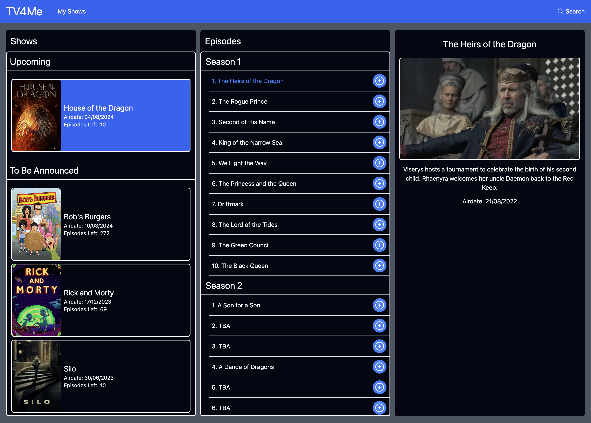

# TV4Me, the best place to keep track of all your TV shows and find your new favourites.

Personal project using NextJS to keep track of which TV Shows you are watching and the episodes you have watched.

This is a [Next.js](https://nextjs.org/) project bootstrapped with [`create-next-app`](https://github.com/vercel/next.js/tree/canary/packages/create-next-app).

## Screenshots

<p align="center">
  
</p>

## Tech Stack

### [Next.js 14](https://nextjs.org/)

### [Mongoose / MongoDB](https://mongoosejs.com/)

### [Tailwindcss](https://tailwindcss.com/)

## API Documentation

This project uses the [`TVDB Api`](https://thetvdb.com/api-information) to get all the information about the TV Shows.

You can get an API key under the free tier by just making an account and applying.

Here you can find the page to test and get the structure of all the API calls, [`API Test Page`](https://thetvdb.github.io/v4-api/#/).

Use your API key on the `/login` endpoint to get your `Bearer Token` for all future API calls, this token is added as `authentication` to the header of each call.

Add your `Bearer Token` to your `.env` file as `TVDB_TOKEN`.

This is the git repo for the API [`API Git Repo`](https://github.com/thetvdb/v4-api).

## Running the app

Firstly, clone the repository and then `cd` into the directory.

```bash
git clone https://github.com/rollokd/tv4me.git

cd tv4me/

npm install
```

Secondly, make sure you have a recent version of mongoDB running locally on your machine.

Finally, run the development server:

```bash
npm run dev
# or
yarn dev
# or
pnpm dev
# or
bun dev
```

Open [http://localhost:3000](http://localhost:3000) with your browser to see the result.

You can start editing the page by modifying `app/page.tsx`. The page auto-updates as you edit the file.

This project uses [`next/font`](https://nextjs.org/docs/basic-features/font-optimization) to automatically optimize and load Inter, a custom Google Font.

## Learn More

To learn more about Next.js, take a look at the following resources:

- [Next.js Documentation](https://nextjs.org/docs) - learn about Next.js features and API.
- [Learn Next.js](https://nextjs.org/learn) - an interactive Next.js tutorial.

You can check out [the Next.js GitHub repository](https://github.com/vercel/next.js/) - your feedback and contributions are welcome!

## Contributiors

<table>
  <tr>
     <td align="center" ><a href="https://github.com/rollokd"><br /><sub><b><a href="https://www.linkedin.com/in/rollo-kennedy-dyson" title="linkedin">Rollo Kennedy-Dyson</a></b></sub></a><br /><a href="https://github.com/rollokd/splitease/commits?author=rollokd" title="Code">💻</a> <a href="#ideas-rollokd" title="Ideas & Planning">🤔</a> <a href="#review-rollokd" title="Reviewed Pull Requests">👀</a> <a href="#design-rollokd" title="Design">🎨</a> <a href="#maintain-rollokd" title="Maintenance">🚧</a></td>
  </tr>
</table>

## Attribution

<table>
  <tr>
    <td align='center' height='100px'>
      <a class="thetvdbattribution" href="https://thetvdb.com/subscribe">
        
        <p>Metadata provided by TheTVDB. Please consider adding missing information or subscribing.</p>
      </a>
    </td>
  </tr>
</table>
