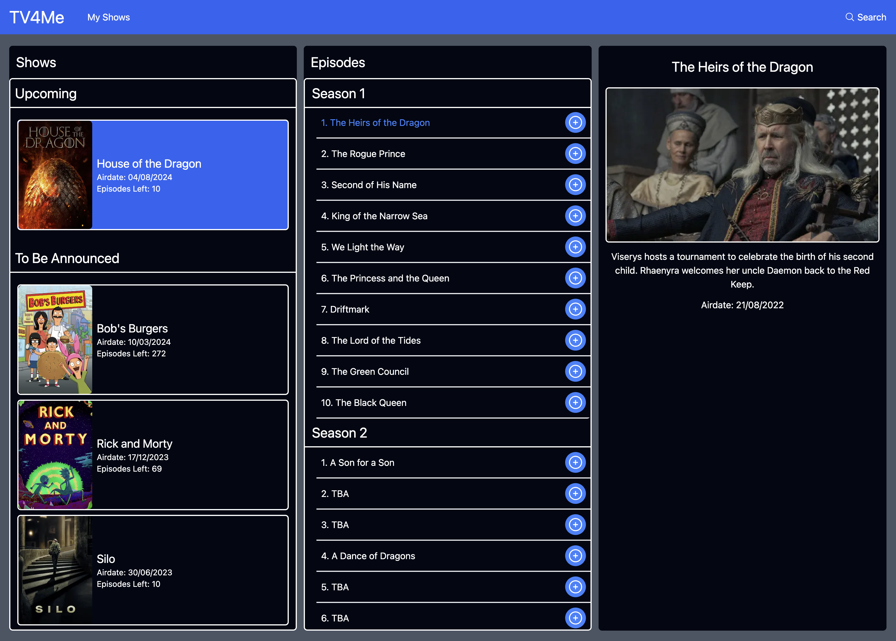

# TV4Me

Personal app for tracking TV shows and episodes, built for [Vercel](https://vercel.com/) with [Neon](https://neon.tech/) Postgres.

## Tech stack

- **Next.js** (App Router)
- **Better Auth** (email/password, passkey plugin) with **Drizzle ORM** on **Neon**
- **The Movie Database (TMDB)** for TV metadata and images

## Environment variables

Create a `.env.local` (see [`envConfig.ts`](envConfig.ts) — Next loads it automatically):

| Variable | Purpose |
|----------|---------|
| `DATABASE_URL` | Neon Postgres connection string |
| `TMDB_READ_TOKEN` | TMDB API read access token ([getting started](https://developer.themoviedb.org/reference/getting-started)) |
| `BETTER_AUTH_SECRET` | Long random secret for Better Auth |
| `BETTER_AUTH_URL` | Public origin of the app (e.g. `http://localhost:3000` in dev) |

## Database migrations

SQL migrations live in [`drizzle/`](drizzle/). Apply them to your Neon branch (e.g. with Drizzle Kit, Neon console, or your usual migration runner).

```bash
pnpm exec drizzle-kit push   # or migrate via your hosted workflow
```

## Development

```bash
pnpm install
pnpm dev
```

Open [http://localhost:3000](http://localhost:3000).

## Marathon CSV import

If you have a `marathon-tv-exports` folder (from Marathon TV), you can import `shows.csv` and `history-*.csv` into Postgres. **`Series ID` is treated as a TMDB TV id.**

```bash
pnpm import:marathon
# optional:
pnpm import:marathon -- --export-dir ./marathon-tv-exports --user-id <better-auth-user-id> --dry-run
```

Default `--user-id` is set in [`scripts/import-marathon.ts`](scripts/import-marathon.ts); override for another account.

## Attribution

This product uses the TMDB API but is not endorsed or certified by TMDB. See the in-app footer for the official attribution link.

## Screenshots

<p align="center">
  
</p>

## Contributors

<table>
  <tr>
     <td align="center"><a href="https://github.com/rollokd"><br /><sub><b><a href="https://www.linkedin.com/in/rollo-kennedy-dyson" title="linkedin">Rollo Kennedy-Dyson</a></b></sub></a><br /><a href="https://github.com/rollokd/splitease/commits?author=rollokd" title="Code">💻</a> <a href="#ideas-rollokd" title="Ideas & Planning">🤔</a> <a href="#review-rollokd" title="Reviewed Pull Requests">👀</a> <a href="#design-rollokd" title="Design">🎨</a> <a href="#maintain-rollokd" title="Maintenance">🚧</a></td>
  </tr>
</table>
